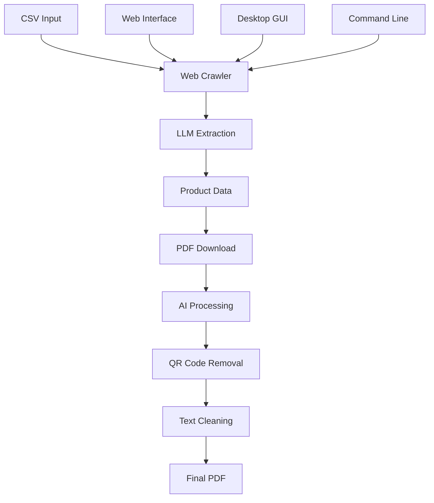

# AI Web Crawler & PDF Processor

<div align="center">


**An enterprise-grade AI-powered web crawler that intelligently extracts product information and processes PDF documents with advanced automation.**

[🚀 Features](#-features) • [📋 Requirements](#-requirements) • [🛠️ Installation](#️-installation) • [🎯 Usage](#-usage) • [📚 Documentation](#-documentation) • [🤝 Contributing](#-contributing)

</div>

---

## 🌟 Overview

The **AI Web Crawler** is a sophisticated, production-ready system that combines advanced web crawling capabilities with intelligent PDF processing. Built on the powerful Crawl4AI framework, it leverages multiple Large Language Models (LLMs) to extract structured product data and automatically process downloaded PDFs with AI-powered content cleaning.

### Key Capabilities

- **🧠 AI-Powered Extraction**: Uses multiple LLM providers (Groq, OpenAI, Anthropic) for intelligent data extraction
- **📄 Advanced PDF Processing**: Automatically removes QR codes, contact information, and unwanted content
- **🔄 Intelligent Pagination**: Supports multiple pagination types with automatic detection
- **🌐 Multiple Interfaces**: Web UI, Desktop GUI, and Command Line interfaces
- **📊 Comprehensive Output**: Organized file structure with detailed CSV reports

---

## 🚀 Features

### **AI-Powered Product Extraction**
- **Multi-LLM Support**: Groq, OpenAI, and Anthropic models
- **Universal Compatibility**: Works with any website layout without custom configuration
- **Schema Validation**: Pydantic-based data validation ensures quality
- **Duplicate Prevention**: Intelligent duplicate detection using name-based hashing

### **Advanced Pagination System**
- **Multiple Types**: Page-based, offset-based, limit-offset, and cursor-based pagination
- **Auto-Detection**: Intelligent pagination pattern recognition
- **JavaScript Support**: Dynamic pagination using button clicks and JS execution
- **Parameter Management**: Preserves existing URL parameters while managing pagination

### **Comprehensive PDF Processing**
- **Automatic Download**: Downloads PDFs from product detail pages
- **AI Content Cleaning**: Removes contact information, QR codes, and unwanted content
- **Smart Organization**: Organizes PDFs by product name and category
- **Background Estimation**: Intelligent background color detection for seamless removal
- **Cover Page Integration**: Automatically adds custom cover pages

### **Enterprise Features**
- **Web Interface**: Modern Flask-based dashboard with real-time monitoring
- **Desktop GUI**: Tkinter-based application for offline use
- **Command Line**: Full automation support for batch processing
- **Security**: Optional password protection and secure file handling
- **Archiving**: Automatic compression and archiving of results

---

## 📋 Requirements

### **System Requirements**
- **Python**: 3.8 or higher
- **Operating System**: Windows, macOS, or Linux
- **Memory**: Minimum 4GB RAM (8GB+ recommended)
- **Storage**: 2GB+ free space for dependencies and output

### **External Dependencies**
- **Tesseract OCR**: For PDF text recognition
- **Poppler**: For PDF to image conversion

### **API Keys** (Optional but Recommended)
- **Groq API Key**: For fast, cost-effective AI processing
- **OpenAI API Key**: For GPT model access
- **Anthropic API Key**: For Claude model access

---

## 🛠️ Installation

### **1. Clone the Repository**
```bash
git clone <repository-url>
cd deepseek-ai-web-crawler
```

### **2. Install Python Dependencies**
```bash
pip install -r requirements.txt
```

### **3. Install System Dependencies**

#### **Windows**
```bash
# Download and install Tesseract OCR
# https://github.com/UB-Mannheim/tesseract/wiki

# Download and install Poppler
# https://github.com/oschwartz10612/poppler-windows/releases
```

#### **macOS**
```bash
brew install tesseract poppler
```

#### **Linux (Ubuntu/Debian)**
```bash
sudo apt-get update
sudo apt-get install tesseract-ocr poppler-utils
```

### **4. Environment Setup** (Optional)
Create a `.env` file in the project root:
```env
GROQ_API_KEY=your_groq_api_key_here
OPENAI_API_KEY=your_openai_api_key_here
ANTHROPIC_API_KEY=your_anthropic_api_key_here
FLASK_SECRET_KEY=your_secret_key_here
FLASK_APP_PASSWORD=your_app_password_here
```

---

## 🎯 Usage

### **Option 1: Web Interface** (Recommended)

1. **Start the Web Server**
   ```bash
   python app.py
   ```

2. **Access the Dashboard**
   - Open your browser to `http://localhost:5000`
   - Upload your CSV configuration file
   - Enter your API key and select model
   - Monitor progress in real-time

### **Option 2: Desktop GUI**

1. **Launch the Desktop Application**
   ```bash
   python web_crawler_gui.py
   ```

2. **Configure Settings**
   - Select your CSV file
   - Enter API credentials
   - Choose processing options
   - Start crawling with visual feedback

### **Option 3: Command Line**

1. **Prepare Input File** (`sites.csv`)
   ```csv
   url,cat_name,css_selector,pdf_selector,name_selector,button_selector
   "https://example.com/products","Category A","div.product-item","a.pdf-link","h1.product-title","button.load-more"
   ```

2. **Run the Crawler**
   ```bash
   python main.py
   ```

### **Input File Format**

The CSV configuration file should contain:

| Column | Description | Example |
|--------|-------------|---------|
| `url` | Starting URL for product catalog | `https://example.com/products` |
| `cat_name` | Category name for organization | `Butterfly Valves` |
| `css_selector` | CSS selector for product elements | `div.product-item\|li.product-card` |
| `pdf_selector` | CSS selector for PDF links | `a[href*=".pdf"]\|button.download` |
| `name_selector` | CSS selector for product names | `h1.product-title` |
| `button_selector` | CSS selector for pagination buttons | `button.load-more` |

---

## 📚 Documentation

### **Architecture Overview**



### **Data Flow**

1. **Input Processing**: CSV configuration parsed and validated
2. **Web Crawling**: Pages crawled using Crawl4AI framework
3. **AI Extraction**: LLM extracts structured product data
4. **PDF Discovery**: PDF links identified and downloaded
5. **Content Processing**: AI-powered cleaning and optimization
6. **Output Generation**: Organized files and comprehensive reports

### **Supported Models**

| Provider | Models | Best For |
|----------|--------|----------|
| **Groq** | `llama-3.1-8b-instant`, `mixtral-8x7b-32768` | Fast processing, cost-effective |
| **OpenAI** | `gpt-4o`, `gpt-4o-mini` | High accuracy, complex extraction |
| **Anthropic** | `claude-3-5-sonnet`, `claude-3-haiku` | Balanced performance |

### **Output Structure**

```
output/
├── Category A/
│   ├── Product 1/
│   │   ├── catalog.pdf
│   │   ├── datasheet.pdf_cleaned.pdf
│   │   └── manual.pdf_cleaned.pdf
│   └── Product 2/
│       └── ...
├── Category B/
│   └── ...
CSVS/
├── downloaded_Category_A_20250101_120000.csv
├── downloaded_Category_B_20250101_120500.csv
└── ...
```

---

## 🔧 Configuration

### **Advanced Settings**

Edit `config.py` to customize:

```python
DEFAULT_CONFIG = {
    "output_folder": "output",
    "default_model": "groq/llama-3.1-8b-instant",
    "crawler_settings": {
        "page_timeout": 30000,
        "max_pages": 10,
        "delay_min": 3,
        "delay_max": 15
    },
    "pdf_settings": {
        "max_file_size_mb": 60,
        "skip_large_files": True
    }
}
```

### **PDF Processing Options**

- **QR Code Removal**: Automatic detection and removal
- **Contact Information**: AI-powered identification and removal
- **Background Estimation**: Intelligent color matching
- **Footer Processing**: Automatic footer area detection and cleaning

---

## 🚨 Troubleshooting

### **Common Issues**

#### **No Products Extracted**
- ✅ Verify website accessibility
- ✅ Check CSS selectors in CSV
- ✅ Ensure API key is valid
- ✅ Test with JavaScript rendering disabled

#### **Pagination Not Working**
- ✅ Check URL format in input file
- ✅ Verify button selectors for JS pagination
- ✅ Try different pagination types
- ✅ Check browser console for errors

#### **PDF Downloads Failing**
- ✅ Verify PDF links are accessible
- ✅ Check file size limits
- ✅ Ensure Tesseract/Poppler are installed
- ✅ Check authentication requirements

#### **Import Errors**
- ✅ Install all dependencies: `pip install -r requirements.txt`
- ✅ Verify Python version (3.8+)
- ✅ Check system dependencies (Tesseract, Poppler)
- ✅ Update pip: `pip install --upgrade pip`

### **Debug Mode**

Enable verbose logging:

```python
def get_browser_config() -> BrowserConfig:
    return BrowserConfig(
        browser_type="chromium",
        headless=False,  # Set to False for debugging
        verbose=True,    # Enable debug logging
    )
```

---

## 📈 Performance Optimization

### **Best Practices**

- **Rate Limiting**: Respectful 3-15 second delays between requests
- **Session Management**: Efficient browser session handling
- **Memory Management**: Automatic cleanup and garbage collection
- **Duplicate Prevention**: Smart caching to avoid redundant processing

### **Scaling Considerations**

- **Concurrent Processing**: Multiple crawler instances
- **Resource Management**: Configurable memory and CPU limits
- **Error Recovery**: Graceful handling of network issues
- **Progress Tracking**: Real-time status monitoring

---

## 🔒 Security & Privacy

### **Security Features**

- **Optional Authentication**: Password-protected web interface
- **Secure File Handling**: Path traversal protection
- **Input Validation**: Comprehensive data sanitization
- **Session Management**: Secure session handling

### **Privacy Considerations**

- **Data Minimization**: Only extracts necessary information
- **Local Processing**: All data processed locally
- **No Data Retention**: Temporary files automatically cleaned
- **API Key Security**: Secure credential management

---

## 🤝 Contributing

We welcome contributions! Please see our [Contributing Guidelines](CONTRIBUTING.md) for details.

### **Development Setup**

1. Fork the repository
2. Create a feature branch: `git checkout -b feature/amazing-feature`
3. Make your changes
4. Add tests if applicable
5. Commit your changes: `git commit -m 'Add amazing feature'`
6. Push to the branch: `git push origin feature/amazing-feature`
7. Open a Pull Request

### **Code Style**

- Follow PEP 8 guidelines
- Use type hints where appropriate
- Add docstrings for functions and classes
- Include error handling and logging

---

## 📄 License

This project is licensed under the **Apache License, Version 2.0** - see the [LICENSE](LICENSE) file for details.

**Important**: Please also read the [NOTICE](NOTICE) file for additional terms and conditions, including employment-based usage restrictions.

---

## 🙏 Acknowledgments

- **[Crawl4AI](https://github.com/unclecode/crawl4ai)**: For the powerful web crawling framework
- **[Groq](https://groq.com/)**: For fast, cost-effective LLM inference
- **[DeepSeek](https://www.deepseek.com/)**: For intelligent extraction models
- **[OpenAI](https://openai.com/)**: For GPT model access
- **[Anthropic](https://www.anthropic.com/)**: For Claude model access
- **[OpenCV](https://opencv.org/)**: For image processing capabilities
- **[Tesseract](https://github.com/tesseract-ocr/tesseract)**: For OCR functionality
- **[Poppler](https://poppler.freedesktop.org/)**: For PDF processing utilities

---

## 📞 Support

### **Getting Help**

1. **Documentation**: Check this README and inline code comments
2. **Issues**: Open an issue on GitHub for bugs or feature requests
3. **Discussions**: Use GitHub Discussions for questions and ideas
4. **Examples**: Review the sample CSV files in the `uploads/` directory

### **Reporting Issues**

When reporting issues, please include:
- Python version
- Operating system
- Error messages and stack traces
- Sample input data (anonymized)
- Steps to reproduce

---

## 🔄 Recent Updates

- ✅ Enhanced pagination system with automatic detection
- ✅ JavaScript-based pagination for dynamic sites
- ✅ Advanced PDF processing with AI-powered content cleaning
- ✅ Improved duplicate detection and prevention
- ✅ Better error handling and logging
- ✅ Support for complex URL parameters
- ✅ Multiple interface options (Web, Desktop GUI, CLI)
- ✅ Support for multiple LLM providers
- ✅ Security enhancements and password protection
- ✅ Comprehensive file management and archiving

---

## 📊 Project Statistics


---

<div align="center">

**Built with ❤️ by the AI Web Crawler Team**

[⬆ Back to Top](#deepseek-ai-web-crawler--pdf-processor)

</div>